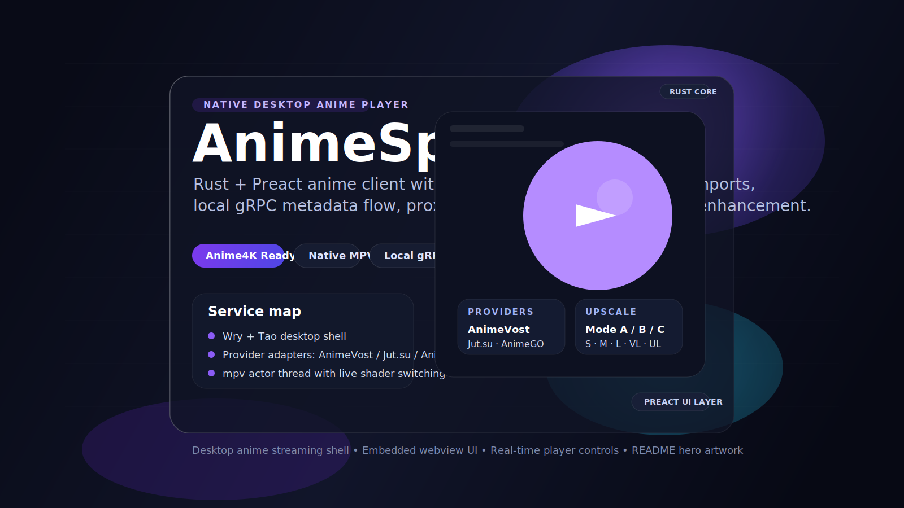

# AnimeSphere



**AnimeSphere** is a native desktop anime player that combines a Rust shell, an embedded Preact UI, a local gRPC metadata layer, multi-provider anime import/search flows, and an `mpv` playback engine with optional Anime4K shader upscaling.

## What It Is

AnimeSphere is not just a web wrapper. The current codebase is a hybrid desktop app with:

- `tao` + `wry` for the native window and embedded webview
- `preact` + `vite` + `tailwindcss` for the UI bundle
- `tokio` + `tonic` for a local in-process gRPC transport
- `libmpv2` for playback control and native video rendering
- provider adapters for AnimeVost, Jut.su, AnimeGO, and Shikimori
- Anime4K GLSL shader switching directly from the player UI

## Mini Description

AnimeSphere is a focused anime desktop client for browsing titles, importing episode playlists from multiple sources, and watching them in a native `mpv` viewport with fullscreen controls, playback sync, proxy-aware media fetching, and optional real-time Anime4K enhancement.

## Current Feature Set

- Native desktop shell with embedded single-file frontend bundle
- Local gRPC catalog service backed by JSON files in the user config directory
- Search/import flow for multiple providers through a shared `ProviderManager`
- Direct `mpv` control for play, pause, seek, stop, volume, and fullscreen
- Anime4K Mode `A / B / C` plus quality tiers `S / M / L / VL / UL`
- Proxy-aware HTTP fetching for metadata, streams, and proxied cover images
- Playback state bridge from Rust to UI through Tao user events
- Search history and persistent settings stored outside the repo
- Portable Windows packaging and CI packaging for Linux/macOS archives

## Provider Coverage

| Provider | Search | Metadata | Episode import | Stream resolution |
|---|---|---:|---:|---:|
| AnimeVost | Yes | Yes | Yes | Direct media URLs |
| Jut.su | URL/slug driven | Yes | Yes | Episode page -> MP4 sources |
| AnimeGO | Yes | Yes | Yes | AniBoom/CVH player resolution |
| Shikimori | Yes | Yes | Metadata only | No built-in stream source |

## Architecture

```text
Preact UI
  -> window.ipc.postMessage(...)
Rust Wry IPC handler
  -> ProviderManager / AnimeService / MpvService
Local gRPC metadata server
  -> episodes.json catalog
Provider adapters
  -> AnimeVost / Jut.su / AnimeGO / Shikimori
mpv actor thread
  -> native playback + Anime4K shader switching
```

### Main Runtime Flow

1. `src/main.rs` starts Tokio and launches the local gRPC server on `127.0.0.1:50051`.
2. `src/window/app.rs` creates the native window, webview, and IPC bridge.
3. `src/services/grpc_anime.rs` talks to the in-process gRPC service for catalog and stream lookup.
4. `src/window/ipc.rs` routes frontend actions into Rust services.
5. `src/services/provider_manager.rs` chooses the provider that can handle a given ID or URL.
6. `src/services/mpv_player.rs` owns the player thread and applies Anime4K shader chains.

## Codebase Highlights

### Native shell

- [src/main.rs](src/main.rs) boots the runtime and local server.
- [src/window/app.rs](src/window/app.rs) embeds the built frontend and attaches `mpv` to a real native window handle on Windows, Linux X11, and macOS.
- [src/window/protocol.rs](src/window/protocol.rs) defines the custom `vostmedia://` fetch path used for cover images and proxy-aware image loading.

### Service layer

- [src/local_server.rs](src/local_server.rs) keeps the local catalog in memory and persists it to `episodes.json`.
- [src/services/grpc_anime.rs](src/services/grpc_anime.rs) exposes the catalog to the desktop UI through gRPC.
- [src/services/provider_manager.rs](src/services/provider_manager.rs) coordinates provider discovery, metadata loading, search, and stream resolution.

### Providers

- [src/services/animevost.rs](src/services/animevost.rs) uses the AnimeVost API and imports sorted episode playlists.
- [src/services/jutsu.rs](src/services/jutsu.rs) scrapes Jut.su pages and resolves direct MP4 sources from episode pages.
- [src/services/animego.rs](src/services/animego.rs) parses AnimeGO metadata, episode schedules, and AniBoom/CVH player backends.
- [src/services/shikimori.rs](src/services/shikimori.rs) adds metadata/search support for discovery without playback sources.

### Frontend

- [frontend/src/app.tsx](frontend/src/app.tsx) contains the full application interface, native bridge calls, playback controls, search UI, settings modal, fullscreen handling, and Anime4K panel.
- [frontend/src/index.css](frontend/src/index.css) sets the dark neon visual language that the README poster follows.
- [frontend/vite.config.ts](frontend/vite.config.ts) builds the UI as a single embedded file for Wry.

## Anime4K Integration

AnimeSphere ships with the shader files under [`shaders/`](shaders) and exposes three curated runtime chains:

- `Mode A`: restore -> upscale
- `Mode B`: soft restore -> upscale
- `Mode C`: upscale + denoise

The active chain is built in [src/services/mpv_player.rs](src/services/mpv_player.rs), then applied through `mpv.command("change-list", ["glsl-shaders", ...])`.

## Configuration And Data

The app persists user data under a platform-specific config directory:

- Windows: `%APPDATA%/animesphere`
- macOS: `~/Library/Application Support/animesphere`
- Linux: `${XDG_CONFIG_HOME:-~/.config}/animesphere`

Files currently used:

- `config.json` — proxy URL and active search provider
- `database.json` — history titles
- `episodes.json` — current imported local catalog for playback

## Build And Run

### Frontend

```bash
cd frontend
npm install --legacy-peer-deps
npm run build
```

### Rust app

Windows:

```powershell
$env:PROTOC = "c:\projects\animesphere\bin\protoc\bin\protoc.exe"
cargo build --release
```

Linux:

```bash
sudo apt-get install -y pkg-config libgtk-3-dev libwebkit2gtk-4.1-dev libmpv-dev protobuf-compiler
export PROTOC=/usr/bin/protoc
cargo build --release
```

macOS:

```bash
brew install mpv protobuf
cargo build --release
```

### Portable Windows package

```powershell
./build_release.ps1
```

That script builds the frontend, compiles the app, copies `animesphere.exe`, `libmpv-2.dll`, and the `shaders/` folder, then creates `animesphere_portable.zip`.

## CI / Release Pipeline

The repository contains a GitHub Actions workflow at [.github/workflows/build.yml](.github/workflows/build.yml) that:

- builds Linux and macOS release binaries
- packages each binary with the `shaders/` directory
- uploads those archives as artifacts
- creates a GitHub Release automatically on tag pushes matching `v*`

## Honest Project Status

Based on the current codebase, this is the practical state of the project:

- Windows is the most complete portable target right now because the repo includes `mpv-sdk` assets and a dedicated packaging script.
- Linux packaging is configured in CI and already includes the shader bundle.
- macOS packaging is in progress; the workflow is present, but `libmpv` discovery/bundling still needs stabilization for a truly portable release archive.
- Some frontend mock fallback data still exists for browser-only previewing when the native bridge is missing.
- Search/provider UX is usable, but provider reliability depends on third-party sites and scraping stability.

## Why This Project Is Interesting

- It uses gRPC locally inside a desktop app instead of treating everything as direct in-process function calls.
- It mixes metadata scraping, stream resolution, and native playback in a compact Rust app.
- It already contains a meaningful player-quality differentiator: Anime4K shader control in the UI.
- It is structured like a service-oriented desktop product, not a one-file media prototype.

## Suggested README Assets

- Poster: [assets/readme/animesphere-poster.svg](assets/readme/animesphere-poster.svg)
- App icon set: [assets/](assets)

## Near-Term Improvements

- Bundle macOS runtime dependencies cleanly for portable releases
- Add screenshots/GIFs from the real running client
- Split the very large frontend component into focused screens and player modules
- Add provider health checks and retry/reporting UX
- Persist richer library state than a single active `episodes.json` catalog

